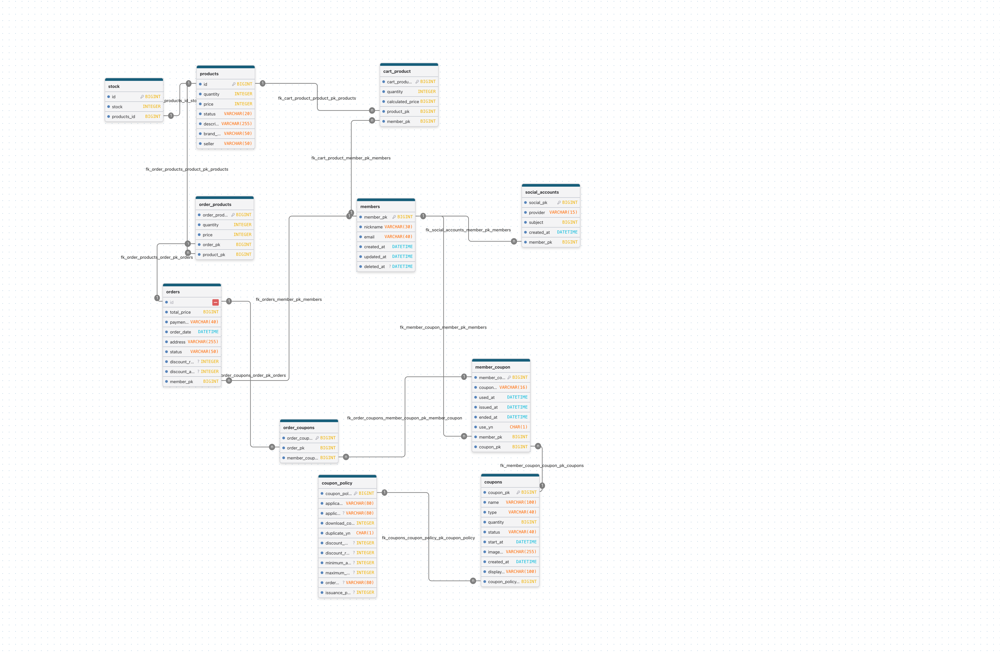

# Cyber Monday

## 1. 개요

다양한 할인으로 발생한 사용자들의 대량 주문 트래픽에 대해 안정적인 서비스를 제공하는 경험을 해보고자 시작한 쿠폰/세일 중심 프로젝트입니다.

사이버 먼데이는 연휴가 끝난 후 일상생활에 복귀한 소비자들에게 온라인으로 물건을 구매하도록 독려한 데서 나왔습니다. 이 서비스는 월요일에 몰려드는 사용자들에 앞서 주문에 대해 빠르고 정확한 피드백을 받도록 안정적인 서비스를 제공하는 것이 목표입니다.

## 2. 기술 스택

- JDK 21
- Spring Boot 3.5.10
- Spring Security 6.5.5
- Spring Cloud OpenFeign 4.3.0
- Spring Data JPA
- Redis 7.2
- Kafka 3.9.1
- MySQL 8.4.8
- Amazon Web Service

## 3. ERD

## 4. 사용자 시나리오

https://github.com/f-lab-edu/cyber-monday/wiki/02.-%EC%82%AC%EC%9A%A9%EC%9E%90-%EC%8B%9C%EB%82%98%EB%A6%AC%EC%98%A4

## 5. flow chart

https://github.com/f-lab-edu/cyber-monday/wiki/03.-Flow-Chart

## 6. API 목록

https://github.com/f-lab-edu/cyber-monday/wiki/04.-API-%EB%AA%A9%EB%A1%9D
